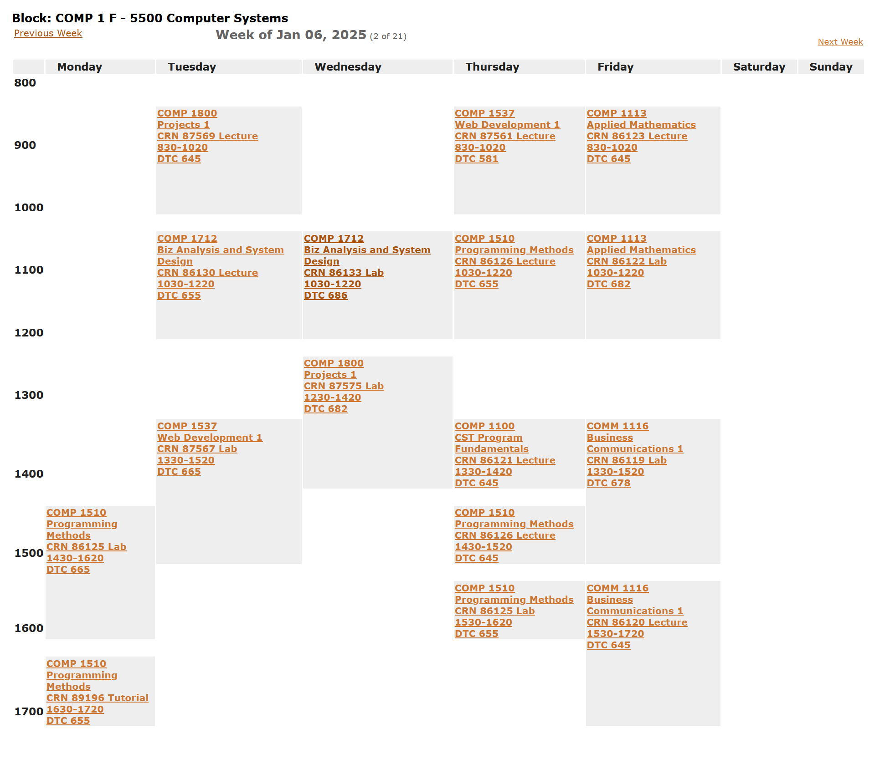
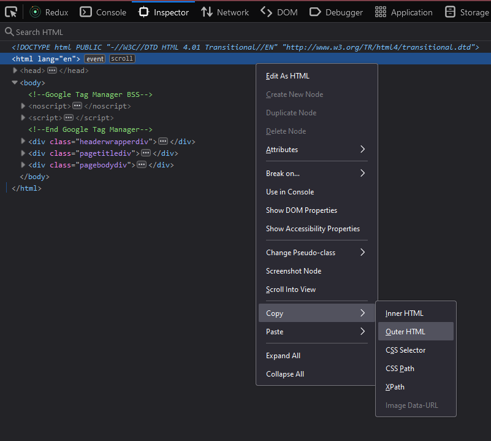

# BCIT Schedule Parser

### How to Use
1. Clone this repository
2. Run `npm install`
3. Duplicate `.env.local` and rename to `.env`.
4. Replace the `START_DATE` and `END_DATE` values with your own program's start and end dates.
5. Open your BCIT schedule and copy the entire HTML using your browser devtools. 

6. Replace the HTML in `src/template.ts` with your own schedule's HTML.
7. Run `npm run start` from your console
8. Open `schedule.ical` in the root folder
